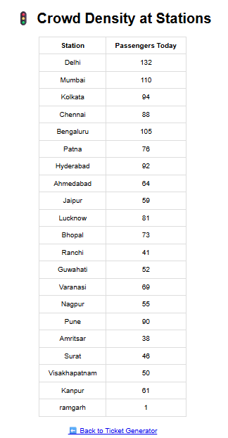

## 👤 About Developer


### Ashish Ranjan

🚀 Duo developer of the RailFlow Project  
🎯 Specialization: QR-Based Ticketing & Crowd Management  
💡 “I believe in building simple tech that solves real-world public problems.”  
🔗 GitHub: [Ashishhhx07](https://github.com/Ashishhhx07)  
🗓️ Submitted for: RailHack 2025

### Sagar Kumar Singh

🚀 UI Reviewer & Presentation Assistant  
💡 Contributed by reviewing the UI design, assisting in demo/pitch prep, and research support.

---

## 👥 Team

- **Ashish Ranjan** – Full-Stack Developer  
  Built the entire RailFlow system from scratch including backend, frontend, and data logic.

- **Sagar Kumar Singh** – UI Reviewer & Presentation Assistant  
  Contributed by reviewing the UI design, assisting in demo/pitch prep, and research support.


# 🚆 RailFlow – QR Ticketing & Crowd Management

### 💡 Overview
RailFlow is a smart ticketing system built for RailHack 2025. It uses QR codes to issue digital tickets and simultaneously tracks real-time passenger crowd at each railway station.

---

### 🔧 Tech Stack

- **Frontend**: HTML + CSS
- **Backend**: Python Flask
- **QR Generator**: qrcode Python library
- **Database**: JSON file (`crowd_data.json`)

---

### 📦 Features

- 🎫 QR Code-based digital ticket
- 🧑‍🤝‍🧑 Real-time station crowd tracking
- 🧠 User-friendly interface
- 💡 Lightweight & fast

---

## 📸 Screenshots

### 🎫 QR Ticket


### 📊 Crowd Status Page



### 🚀 How to Run Locally

1. Clone or Download the repo  
2. Install dependencies:
   ```bash
   pip install flask qrcode
